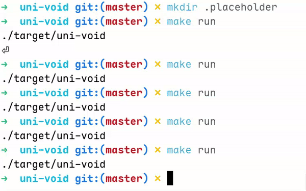

# Uni-Void
> A sliding puzzle game inside your terminal

Hey all! This is a super simple tui-based game that I made for learning purposes. Let me explain what the game is. The player is presented with an n×n matrix with shuffled numbers and one empty tile. you are tasked with sorting the matrix in ascending order by sliding that empty tile around inside the matrix. You can choose a difficulty at the beginning and a leaderboard is displayed on game completion. That's all!

#### demo:


---

## 🔧 Build Instructions

### Requirements
The following packages are required to compile the game.

- `clang` or `gcc` compiler
- `ncurses` development library

### Compile

#### Compiling and run:
```bash
git clone https://github.com/harikrishnamohann/uni-void.git
cd uni-void
chmod +x ./built.sh
./build.sh release run
```

Now, an executable named uni-void should be produced inside the target directory 

---

### 🎮 Controls

| Key | Action |
|-----|--------|
| Arrow Keys / WASD /vim-keys | Movement keys |
| `?` | Show help dialog |
| `Enter` | Select menu item |
| `u` | Undo last move |
| `r` | Redo undone move |
| `qq` | save and quit game |
| `Q` | Force quit (no save) |

---

### 📑 Todo
- ~~highlight characters that are in place~~
- ~~a menu for choosing difficulty~~
- ~~detect when game is completed~~
- ~~status line for showing some informations such as counter, difficulty etc~~
- ~~undo redo mechanism~~
- ~~help window~~
- ~~ensure the solvability of puzzle~~
- ~~save and load functionality~~
- ~~add a mode with limited number of moves~~
- ~~display leaderboard on game completion~~
- sound effects

### 🤫 pro-tip: 
you can actually edit the leaderboards

---
